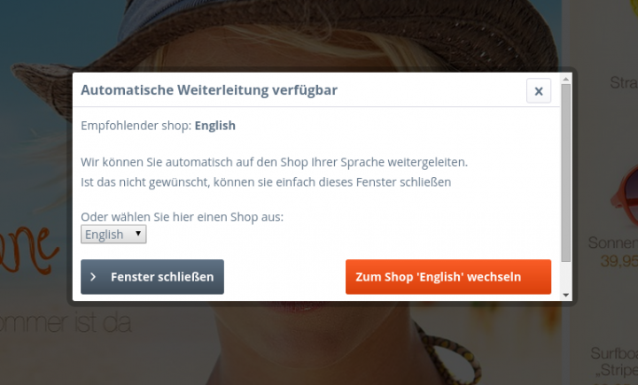

# SwagBrowserLanguage

## Supported versions
Shopware version 5.0.0 or higher

## Description
This plugin automatically detects the language settings of your customer’s browsers and forwards them to the appropriate language or subshop. The browser languages are checked according to their priority.

The following situations can occur:

* The browser language corresponds to the language of your main shop (no forwarding)
* The browser language matches one of the languages offered in your store (forwarded to the appropriate shop)
* The browser language does not match any of the languages offered in your store (forwarded to the main shop, unless otherwise specified)
* The browser language matches one of the subshops but the subshop has not been linked to the main shop (forwarded to the default shop)
* In addition the user will be informed about the redirection before he's being redirected so he can cancel the redirection process manually at any time to stay at the current shop. Beside the proposal it is possible for the user to decide another shop than the suggested one.

Your are missing a language or you found a missing or wrong translation? Help us to improve the available translations of shopware via [crowdin](https://crowdin.com/project/shopware)

## Images

## License

The MIT License (MIT). Please see [License File](LICENSE) for more information.
